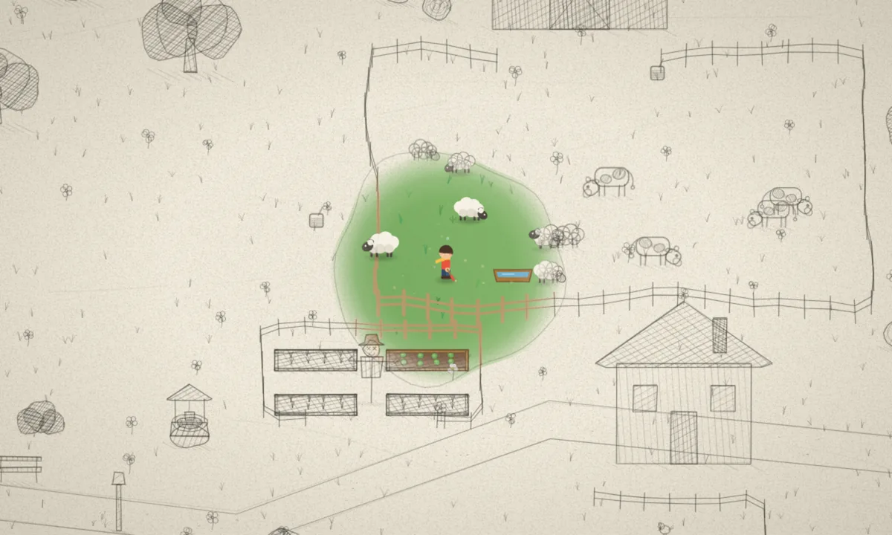

# Pencil & Paint

Someone left this valley half-finished, in graphite.

Colour exists only where you are standing. Step away and the world goes back to
being an unfinished drawing — hatched, outlined, waiting. The sheep out in the
pencil are not paused; they are *drawn*, and a drawing does not move. Walk close
enough and one will lift its head.

Fourteen pots of paint were spilled somewhere in the fields. Each one you find
widens the circle you carry, until there is nothing left of the sketch.

**[Play it →](https://sakateka.github.io/pencil-and-paint/)**

---

The valley is drawn twice — once as a colour illustration, once as pencil — and
the two are composited every frame through a soft mask that follows you.

Most of what makes it work is not the mask, though. It is the hatching that
reads its density from how dark a colour was, so the drawing has tone. It is the
wobble on a live pencil line, which has to hold still for a seventh of a second
or it vibrates instead of looking drawn. It is the seed every tree remembers, so
that it can be re-drawn on top of you, stroke for stroke, when you walk behind it.

All of that is in [`src/`](src/). Start at
[`media/pencil.ts`](src/media/pencil.ts), which is where a colour becomes a
drawing, or [`render/colorField.ts`](src/render/colorField.ts), which decides
where the colour is.

Building, playing and testing: [BUILDING.md](BUILDING.md).

## License

The source is available for study, modification, and sharing, but not for
commercial use. The software is under the
[PolyForm Noncommercial License 1.0.0](LICENSE); original paintings are under
[CC BY-NC 4.0](LICENSE), and third-party recordings keep the terms listed in
[CREDITS.md](CREDITS.md). See [LICENSE](LICENSE) for the exact scope and terms.
